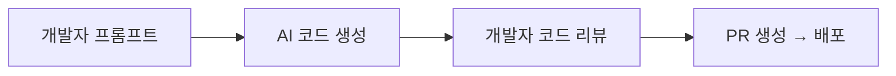

## 1. 들어가며: 60일 후, AI Oversight는 법이다

2026년 6월 현재, EU AI Act의 전면 시행까지 단 60일이 남았다. 2025년 8월 발효 이후 12개월의 유예 기간이 2026년 8월에 종료되면서, **AI 시스템을 개발하거나 통합하는 모든 조직**은 법적 의무를 준수해야 한다.

가장 중요한 변화는 **'AI Oversight'(인간의 감독)**가 모범 사례(best practice)에서 **법적 요구사항(legal requirement)**으로 전환된다는 점이다. EU AI Act Article 14는 "AI 시스템은 개발부터 운영까지 인간이 효과적으로 감독할 수 있는 조치를 갖춰야 한다"고 명시한다.

이는 단순한 문서화 요구사항이 아니다. 실제로 **소프트웨어 아키텍처를 재설계**해야 함을 의미한다. 코드 리뷰 한 번 추가하는 수준이 아니라, **AI가 생성한 코드가 자동으로 배포되는 것을 차단하고, 인간의 검증을 통과한 경우에만 허용하는 시스템**이 필요하다.

> "AI가 코드를 쓰는 시대에, 인간은 무엇을 검증해야 하는가?"
>
> 답은 'Golden Paths'다. AI가 생성한 모든 코드가 조직의 아키텍처 표준을 통과했는지 **자동화된 검증 루프**로 확인하고, 실패 시 인간이 개입하는 구조.

---

## 2. Verification Loop 패턴: 개념과 구조

### 2.1 전통적인 AI-Assisted Development의 문제점

현재 대부분의 AI-assisted development 워크플로우는 **제안-수용(Propose-Accept)** 모델을 따른다:



이 모델의 문제는 **AI가 생성한 코드가 아키텍처 원칙을 위반하는지 여부를 사람이 판단**해야 한다는 점이다. 수백~수천 줄의 AI 생성 코드를 리뷰하는 사람의 인지 부하가 극단적으로 높아지고, 실질적인 검증이 어려워진다.

### 2.2 Verification Loop 아키텍처

Verification Loop는 AI와 인간 사이에 **자동화된 정책 검증 계층**을 삽입한다:

```typescript
// verification-loop-core.ts
// Verification Loop의 핵심 인터페이스

interface VerificationResult {
  passed: boolean;
  violations: PolicyViolation[];
  goldenPathScore: number; // 0-100
  aiGenerated: boolean;
  humanReviewed: boolean;
  timestamp: Date;
}

interface PolicyViolation {
  rule: string;
  severity: 'blocker' | 'warning' | 'info';
  file: string;
  line?: number;
  message: string;
  suggestion?: string; // Golden Paths에 따른 수정 제안
}

interface GoldenPath {
  name: string;
  description: string;
  matcher: RegExp | ((node: ASTNode) => boolean);
  allowedPatterns: string[];
  blockedPatterns: string[];
  autoFix?: (code: string) => string;
}
```

Verification Loop의 3단계:

1. **AI Generation Gate** — AI가 생성한 모든 코드는 CI 단계에서 자동 검증 진입
2. **Policy Evaluation Layer** — Golden Paths 기반 정책 평가 (통과 못하면 자동 차단)
3. **Human Escalation Path** — Blocker 위반이 발생하면 인간 리뷰어에게 즉시 알림

```typescript
// verification-loop-pipeline.ts
// Verification Loop 파이프라인 구현

class VerificationLoopPipeline {
  private policies: PolicyEvaluator[];
  private auditTrail: AuditLogger;

  async evaluate(
    codeChange: CodeChange,
    context: EvaluationContext
  ): Promise<VerificationResult> {
    // Phase 1: AI 생성 여부 감지
    const isAIGenerated = await this.detectAIOrigin(codeChange);
    
    if (!isAIGenerated) {
      // 인간이 작성한 코드는 기존 리뷰 프로세스
      return { passed: true, aiGenerated: false, /* ... */ };
    }

    // Phase 2: Policy Evaluation (auto-block)
    const violations: PolicyViolation[] = [];
    
    for (const policy of this.policies) {
      const result = await policy.evaluate(codeChange, context);
      violations.push(...result.violations);
    }

    const blockers = violations.filter(v => v.severity === 'blocker');
    
    // Phase 3: Auto-fix 시도 (Blocking 패턴 자동 수정)
    if (blockers.length > 0 && context.allowAutoFix) {
      for (const violation of blockers) {
        if (violation.suggestion) {
          const fixed = await this.applyAutoFix(codeChange, violation);
          if (fixed) {
            violations.splice(violations.indexOf(violation), 1);
          }
        }
      }
    }

    const passed = violations.filter(v => v.severity === 'blocker').length === 0;

    // Phase 4: Audit Trail 기록 (법적 요구사항)
    await this.auditTrail.record({
      changeId: codeChange.id,
      result: { passed, violations, aiGenerated: true, /* ... */ },
      reviewer: passed ? 'system' : 'pending-human',
    });

    return {
      passed,
      violations,
      goldenPathScore: this.calculateScore(violations),
      aiGenerated: true,
      humanReviewed: passed, // Auto-passed → system approval
      timestamp: new Date(),
    };
  }
}
```

---

## 3. Golden Paths: 아키텍처 검증의 핵심

### 3.1 Golden Paths의 정의

Golden Paths는 조직의 아키텍처 원칙과 모범 사례를 **기계가 읽을 수 있는 정책**으로 표현한 것이다. 이는 단순한 코딩 컨벤션을 넘어:

- **아키텍처 패턴** — 레이어 간 의존성 방향, 순환 참조 금지
- **보안 규칙** — 하드코딩된 시크릿, SQL 인젝션 가능성
- **성능 기준** — N+1 쿼리 감지, 메모리 누수 패턴
- **규정 준수** — 데이터 접근 로깅, 개인정보 처리 검증

```typescript
// golden-paths.ts
// Golden Paths 정의 예제

const ArchitectureGoldenPaths: GoldenPath[] = [
  {
    name: 'layered-architecture',
    description: 'Presentation → Application → Domain → Infrastructure 레이어 방향으로만 의존성 허용',
    matcher: null, // 전체 AST 분석
    allowedPatterns: [
      'presentation/.*/application/.*',  // Presentation → Application
      'application/.*/domain/.*',        // Application → Domain
      'domain/.*/infrastructure/.*',     // Domain → Infrastructure
      'infrastructure/(?!domain/|application/)', // No reverse dependencies
    ],
    blockedPatterns: [
      'application/.*/presentation/.*',  // 레이어 역전 금지
      'domain/.*/application/.*',        // Domain → Application 금지
    ],
  },
  {
    name: 'no-secrets-in-code',
    description: 'API 키, 토큰, 비밀번호가 코드 내에 포함되지 않아야 함',
    matcher: /(?:api[_-]?key|secret|password|token|credential)\s*[:=]\s*['"][^'"]+['"]/i,
    allowedPatterns: [],
    blockedPatterns: [],
    severity: 'blocker',
    autoFix: (code: string) => {
      // 자동으로 환경 변수 참조로 대체
      return code.replace(
        /api[_-]?key\s*[:=]\s*['"]([^'"]+)['"]/gi,
        `process.env.API_KEY`
      );
    },
  },
];
```

### 3.2 AST 기반 검증 엔진

실전에서는 단순한 정규식 매칭으로는 부족하다. **AST(Abstract Syntax Tree) 기반 검증**이 필요하다:

```go
// goldenpath/ast_checker.go
// Go 기반 AST 검증 엔진

package goldenpath

import (
	"go/ast"
	"go/parser"
	"go/token"
)

type DepGraph struct {
	From string
	To   string
	Line int
}

// CheckLayerViolations: 레이어 의존성 위반 검사
func CheckLayerViolations(source string) []PolicyViolation {
	fset := token.NewFileSet()
	f, err := parser.ParseFile(fset, "", source, parser.ParseComments)
	if err != nil {
		return nil
	}

	var violations []PolicyViolation
	
	// 임포트 경로 분석 - 패키지 명명 규칙 기준
	// e.g., internal/presentation/* → application/* 로의 import 확인
	ast.Inspect(f, func(n ast.Node) bool {
		switch x := n.(type) {
		case *ast.ImportSpec:
			importPath := strings.Trim(x.Path.Value, `"`)
			
			// Domain 레이어 → Infrastructure 레이어 import 검증
			if strings.Contains(source, "package domain") && 
			   strings.HasPrefix(importPath, "internal/infrastructure") {
				violations = append(violations, PolicyViolation{
					Rule:     "layered-architecture",
					Severity: Blocker,
					Message:  "Domain 레이어는 Infrastructure에 의존할 수 없습니다",
					Line:     fset.Position(x.Pos()).Line,
				})
			}
			
			// Infrastructure → Presentation 레이어 역참조 금지
			if strings.Contains(source, "package infrastructure") && 
			   strings.HasPrefix(importPath, "internal/presentation") {
				violations = append(violations, PolicyViolation{
					Rule:     "layered-architecture",
					Severity: Blocker,
					Message:  "Infrastructure 레이어가 Presentation을 참조합니다 (의존성 역전)",
					Line:     fset.Position(x.Pos()).Line,
				})
			}
		}
		return true
	})

	return violations
}
```

---

## 4. CI/CD 통합: Policy-as-Code

### 4.1 GitHub Actions Integration

Verification Loop를 GitHub Actions에 통합하면 PR 단계에서 자동 검증이 가능하다:

```yaml
# .github/workflows/ai-oversight.yml

name: AI Oversight Verification Loop
on:
  pull_request:
    types: [opened, synchronize]

jobs:
  verification-loop:
    runs-on: ubuntu-latest
    steps:
      - uses: actions/checkout@v4
        with:
          fetch-depth: 0  # 전체 히스토리 필요 (AI 생성 감지용)

      - name: Detect AI-Generated Code
        uses: your-org/detect-ai-source@v1
        id: ai-detection
        with:
          threshold: 0.85  # AI 생성 확률 임계값

      - name: Golden Paths Policy Evaluation
        if: steps.ai-detection.outputs.is-ai-generated == 'true'
        uses: your-org/golden-path-checker@v1
        id: policy-check
        with:
          golden-path-config: '.golden-paths.yaml'
          fail-on-blocker: true

      - name: Auto-Fix Blocking Violations
        if: steps.policy-check.outputs.has-blockers == 'true'
        uses: your-org/auto-fixer@v1
        id: auto-fix
        with:
          violations: ${{ steps.policy-check.outputs.violations }}

      - name: Human Escalation
        if: steps.auto-fix.outputs.remaining-blockers > 0
        uses: your-org/escalate-to-human@v1
        with:
          slack-channel: '#ai-oversight-alerts'
          reviewers-team: 'senior-architects'
          change-id: ${{ github.event.pull_request.html_url }}
          violations: ${{ steps.policy-check.outputs.blocker-violations }}
```

### 4.2 Golden Paths 설정 파일

```yaml
# .golden-paths.yaml
# 조직 전체 Golden Paths 정의

version: "v1"
compliance:
  eu-ai-act:
    enabled: true
    article-14-oversight: true  # 인간 감독 조치
    article-26-obligations: true  # 사용자에게 투명성 제공

policies:
  - name: "no-reverse-layer-dependency"
    description: "레이어 간 의존성 방향 검증"
    matcher:
      type: "ast-import"
      layers:
        - name: "presentation"
          depends_on: ["application"]
        - name: "application"
          depends_on: ["domain"]
        - name: "domain"
          depends_on: ["infrastructure"]
        - name: "infrastructure"
          depends_on: []
    severity: "blocker"

  - name: "database-query-sanitization"
    description: "모든 데이터베이스 쿼리는 Prepared Statement 또는 ORM을 사용"
    matcher:
      type: "regex"
      pattern: "(?i)(?:SELECT|INSERT|UPDATE|DELETE).*\\$(?:where|set)\\s*\\+\\s*"
      exclude_file: ".*_test\\.(go|ts)$"
    severity: "blocker"
    auto-fix: false  # 보안 위반은 반드시 인간 검토

  - name: "rate-limit-required"
    description: "모든 외부 API 호출에는 Rate Limiting 적용 필수"
    matcher:
      type: "ast-function-call"
      packages: ["net/http", "axios", "fetch"]
      check: "surrounded-by-rate-limit"
    severity: "warning"
    suggestion: "github.com/hashicorp/go-retryablehttp 또는 axios-rate-limit 사용"

  - name: "observability-mandatory"
    description: "모든 진입점에는 OpenTelemetry span 생성 필수"
    matcher:
      type: "ast-declaration"
      kind: ["handler", "middleware", "controller", "service"]
      check: "has-opentelemetry-tracing"
    severity: "warning"
```

---

## 5. Audit Trail: 법적 증거 체인

### 5.1 Compliance Audit Trail

EU AI Act를 준수하려면 모든 AI 관련 결정의 **audit trail**이 필수다. 이는 단순히 "누가 무엇을 했는가"를 넘어, **"AI가 무엇을 제안했고, 인간이 어떻게 검증했으며, 어떤 정책이 적용되었는가"**를 증명해야 한다:

```typescript
// audit-trail.ts
// Compliance Audit Trail 시스템

interface AuditRecord {
  id: string;
  timestamp: Date;
  
  // AI 생성 코드 정보
  aiContext: {
    model: string;           // 사용된 AI 모델 (e.g., claude-opus-4.8, gpt-5)
    prompt: string;          // 원본 프롬프트 (해싱 가능)
    generationDuration: number;
    confidence: number;      // AI 생성 확률
  };

  // Verification Loop 결과
  verification: {
    loopId: string;
    passedAutomated: boolean;
    automationScore: number;  // Golden Paths 통과 점수
    violations: PolicyViolation[];
    autoFixes: AutoFix[];
  };

  // 인간 개입 기록
  humanOversight: {
    reviewer: string;         // 검토한 인간 엔지니어 ID
    reviewDecision: 'approved' | 'rejected' | 'modified';
    reviewDuration: number;
    reviewComment: string;
    modifiedCode?: string;    // 인간이 수정한 최종 코드
  };

  // 최종 배포 결정
  deployment: {
    approved: boolean;
    deployedAt: Date;
    deployedBy: string;
    changeId: string;         // PR 또는 변경 요청 ID
  };
}

class AuditLogger {
  private db: Database;
  private encryption: Encryption;

  async record(record: AuditRecord): Promise<void> {
    // GDPR/CCPA 요구사항에 따라 개인정보 암호화
    const encrypted = this.encryption.encryptPII(record, [
      'aiContext.prompt',
      'humanOversight.reviewComment',
    ]);

    // Append-only ledger 방식으로 저장
    await this.db.insert('ai_oversight_audit', {
      ...encrypted,
      hash: this.computeHash(encrypted),
      prevHash: await this.getLatestHash(),
    });

    // EU AI Act Article 12: 자동 로깅 요구사항 충족
    await this.syncToComplianceStorage(record.id);
  }

  private computeHash(record: Partial<AuditRecord>): string {
    return crypto.createHash('sha256')
      .update(JSON.stringify(record))
      .digest('hex');
  }

  // 규제 기관 감사 대비
  async generateComplianceReport(
    startDate: Date,
    endDate: Date
  ): Promise<ComplianceReport> {
    const records = await this.db.query(
      'SELECT * FROM ai_oversight_audit WHERE timestamp BETWEEN $1 AND $2',
      [startDate, endDate]
    );

    return {
      totalAIGeneratedPRs: records.length,
      autoApproved: records.filter(r => r.verification.passedAutomated).length,
      humanIntervention: records.filter(r => 
        r.humanOversight.reviewDecision !== undefined
      ).length,
      blockerViolationsResolved: records.flatMap(r => 
        r.verification.violations
      ).length,
      complianceStatus: 'compliant',
      reportGeneratedAt: new Date(),
    };
  }
}
```

### 5.2 실시간 정책 평가 서버

대규모 조직에서는 PR 단계를 기다리지 않고 **실시간(편집 중)** 으로 Golden Paths를 검증하는 게 효율적이다:

```go
// realtime/policy_server.go
// WebSocket 기반 실시간 정책 평가 서버

package realtime

import (
	"encoding/json"
	"log"
	"net/http"
	"sync"

	"github.com/gorilla/websocket"
)

type PolicyServer struct {
	upgrader websocket.Upgrader
	evaluator *PolicyEvaluator
	activeConnections sync.Map
}

// IDE 플러그인이 WebSocket으로 편집 중인 코드를 전송하면 실시간 검증
func (s *PolicyServer) HandleWebSocket(w http.ResponseWriter, r *http.Request) {
	conn, err := s.upgrader.Upgrade(w, r, nil)
	if err != nil {
		log.Printf("WebSocket upgrade error: %v", err)
		return
	}
	defer conn.Close()

	for {
		_, message, err := conn.ReadMessage()
		if err != nil {
			break
		}

		var req EvaluationRequest
		if err := json.Unmarshal(message, &req); err != nil {
			continue
		}

		// 백그라운드에서 정책 평가 (비동기)
		go func(code string) {
			result := s.evaluator.EvaluateCode(code)
			
			if len(result.Violations) > 0 {
				response := EvaluationResponse{
					Violations:  result.Violations,
					Severity:    result.HighestSeverity(),
					Suggestions: result.FixSuggestions(),
				}

				// IDE 내 인라인 경고로 표시
				conn.WriteJSON(response)
			}
		}(req.Code)
	}
}
```

---

## 6. 조직 도입 로드맵

EU AI Act 준수를 위해 60일 안에 완료해야 할 단계:

### Week 1-2: Golden Paths 정의
- 아키텍처 원칙을 정책으로 문서화
- Blocker/Warning/Info 심각도 분류
- 기존 코드베이스 스캔으로 Baseline 통계 확보

### Week 3-4: CI/CD 통합
- GitHub Actions / GitLab CI에 Policy Check Job 추가
- PR 단계에서 Blocking Violation 자동 차단
- Auto-Fix 룰셋 구축

### Week 5-6: Audit Trail 구축
- AI 생성 코드 감지 시스템 도입
- Compliance Audit Logger 구현
- Append-only 저장소 설정

### Week 7-8: 실시간 통합 및 훈련
- IDE 플러그인 배포
- 엔지니어 교육 (Verification Loop 개념, Escalation 프로세스)
- 전체 모의 감사 (Mock Audit) 실행

---

## 7. 결론: 규제를 아키텍처 기회로 전환하라

EU AI Act는 단순한 "또 하나의 규제"가 아니다. **AI가 생성하는 코드의 품질과 안전성을 보장하는 아키텍처 패턴의 표준**을 강제한다.

Verification Loop 패턴의 핵심 통찰:

1. **자동화된 정책 검증이 인간 검토를 대체하지 않고 보완한다** — 반복적이고 기계적인 검사는 AI가, 창의적이고 맥락적인 판단은 인간이 담당
2. **Golden Paths는 아키텍처 지식의 실행 가능한 저장소다** — 문서에만 존재하는 원칙이 CI/CD에서 강제되는 문화
3. **Audit Trail은 법적 방어막이자 학습 데이터다** — 모든 결정이 기록되고 분석되어 시스템이 지속적으로 개선됨

> "AI 시대의 규제 준수는 부담이 아니라, **AI가 생성하는 모든 코드가 당신의 아키텍처 기준을 자동으로 통과하도록 만드는 설계 패턴**이다."
>
> 60일 후, 모든 AI 지원 개발 워크플로우는 Verification Loop를 갖춰야 한다. 지금 시작하라.

---

### 참고 자료

- [EU AI Act 공식 문서](https://artificialintelligenceact.eu/)
- [Microsoft Build 2026: Local Execution Containers for AI](https://build.microsoft.com/)
- [2026 Software Stack Trends: Verification Loop 전략](https://developex.com/blog/software-development-stack-trends-2026/)
- [The Pragmatic Engineer: 2026 Job Market](https://newsletter.pragmaticengineer.com/p/state-of-the-job-market-2026)
