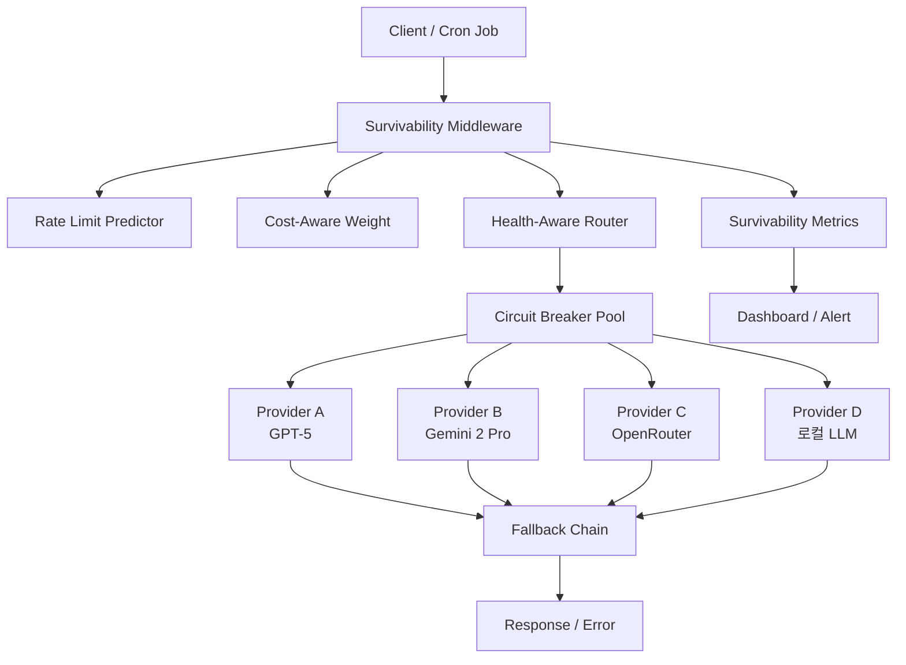

## 1. 들어가며: 17개의 크론잡이 동시에 죽던 날

2026년 5월 26일. 17개의 자동화 크론잡이 모두 **단일 LLM provider(Model: MiniMax-M2.7)**에 의존하고 있었다. 동시 실행 과부하로 provider API가 시간 초과 폭풍을 일으켰고, fallback pool에서 ollama provider는 제거된 직후라 다양성이 더욱 좁아진 상태였다. 결과는 완전 정지. 17개 크론잡 중 단 하나도 정상 실행되지 않았다.

이 사건에서 배운 교훈은 단순하다:

> **"단일 provider 의존은 죽음의 트랩이다. 크론잡이 많아질수록 model pool의 다양성이 생존률을 결정한다."**

이 글에서는 이 경험을 바탕으로 **Multi-Provider Survivability Architecture**를 설계한다. Circuit Breaker, Fallback Chain, Health-Aware Router라는 세 가지 패턴을 조합해, 어떤 provider가 죽어도 시스템이 살아남는 구조를 Go 코드로 직접 구현한다.

## 2. 문제 정의: 단일 Provider 의존의 세 가지 위험

### 2.1. 계단식 장애 (Cascading Failure)

```
[Provider A 장애]
      ↓
모든 Agent가 동시에 Retry
      ↓
Provider A 과부하 심화
      ↓
Timeout → Retry → Backoff 소진
      ↓
전체 Agent 행(Run) 실패
```

17개 크론잡이 동시 Retry를 시작하면, 복구 가능한 순간 장애도 전체 정지로 증폭된다.

### 2.2. 속도 제한 폭주 (Rate Limit Cascade)

Provider의 rate limit은 보통 per-minute 기준이다. 17개 크론잡이 1분 간격으로 3회씩 재시도하면:

```
17 jobs × 3 retries = 51 requests per minute
         ↓
Rate limit (보통 30-60 RPM) 초과
         ↓
429 응답 → Exponential Backoff → 17개 모두 대기
         ↓
Rate limit 윈도우가 다시 열려도 모든 job이 동시에 재시도 → 반복
```

### 2.3. 단일 실패점 (Single Point of Failure)

Model pool에 fallback이 없는 단일 provider 구조:

```
Agent → Provider A
         (죽으면)
Agent → ❌ (대안 없음)
```

## 3. Survivability Architecture: 세 가지 패턴

### 3.1. Circuit Breaker — 죽은 provider를 빨리 감지하라

가장 단순하면서도 강력한 패턴. 연속 실패 횟수가 임계치를 넘으면 provider를 즉시 차단하고, 일정 시간 후 반만 열어(Semi-Open) 복구를 테스트한다.

```go
package provider

import (
    "sync"
    "time"
)

type State int

const (
    StateClosed   State = iota // 정상
    StateOpen                  // 차단됨
    StateHalfOpen              // 반만 열림 (복구 테스트 중)
)

type CircuitBreaker struct {
    mu               sync.RWMutex
    state            State
    failureCount     int
    successCount     int
    lastFailureTime  time.Time

    threshold        int           // 연속 실패 허용 횟수
    recoveryTimeout  time.Duration // Open → HalfOpen 전환 시간
    halfOpenMaxReqs  int           // HalfOpen 상태의 최대 요청 수
    halfOpenReqs     int
}

func (cb *CircuitBreaker) Allow() bool {
    cb.mu.RLock()
    state := cb.state
    cb.mu.RUnlock()

    switch state {
    case StateClosed:
        return true
    case StateOpen:
        // recoveryTimeout 이후 HalfOpen 전환 시도
        if time.Since(cb.lastFailureTime) > cb.recoveryTimeout {
            cb.mu.Lock()
            cb.state = StateHalfOpen
            cb.halfOpenReqs = 0
            cb.mu.Unlock()
            return true
        }
        return false
    case StateHalfOpen:
        cb.mu.Lock()
        defer cb.mu.Unlock()
        if cb.halfOpenReqs < cb.halfOpenMaxReqs {
            cb.halfOpenReqs++
            return true
        }
        return false
    }
    return false
}

func (cb *CircuitBreaker) RecordSuccess() {
    cb.mu.Lock()
    defer cb.mu.Unlock()

    cb.successCount++
    if cb.state == StateHalfOpen {
        // HalfOpen에서 연속 성공 → Closed 복귀
        if cb.successCount >= cb.halfOpenMaxReqs {
            cb.state = StateClosed
            cb.failureCount = 0
            cb.successCount = 0
        }
    }
}

func (cb *CircuitBreaker) RecordFailure() {
    cb.mu.Lock()
    defer cb.mu.Unlock()

    cb.failureCount++
    cb.lastFailureTime = time.Now()

    if cb.state == StateHalfOpen || cb.failureCount >= cb.threshold {
        cb.state = StateOpen
        cb.successCount = 0
    }
}
```

**핵심 설계 의사결정**:
- `threshold = 3` 연속 실패 시 즉시 Open. 한 번의 일시적 503에 전체 서비스가 멈추지 않게 하려면 3~5 사이가 적절하다.
- `recoveryTimeout = 30s`. 30초 후 HalfOpen으로 전환해 복구 여부를 확인한다. 너무 짧으면 잦은 Open/Close 변동(thrashing)이 발생하고, 너무 길면 복구된 provider를 오래 놀린다.
- `halfOpenMaxReqs = 2`. HalfOpen 상태에서는 최대 2개 요청만 통과시켜 폭주를 방지한다.

### 3.2. Fallback Chain — 자동 우회 경로를 설계하라

Circuit Breaker가 provider를 차단하면, Fallback Chain이 다음 provider로 요청을 우회시킨다. 단, 무분별한 fallback은 오히려 문제를 키우므로 명시적인 우선순위와 cooldown 정책이 필요하다.

```go
type ProviderConfig struct {
    Name          string        // "openai-gpt-5"
    BaseURL       string
    Model         string
    RPM           int           // 분당 요청 한도
    TPM           int           // 분당 토큰 한도
    CostPer1K     float64       // USD/1K 토큰
    Priority      int           // 낮을수록 우선
    CircuitBreaker *CircuitBreaker
}

type FallbackChain struct {
    providers []*ProviderConfig
    mu        sync.RWMutex
}

func (fc *FallbackChain) Execute(ctx context.Context, req *LLMRequest) (*LLMResponse, error) {
    var lastErr error

    for _, p := range fc.getAvailableProviders() {
        if !p.CircuitBreaker.Allow() {
            continue
        }

        resp, err := callProvider(ctx, p, req)
        if err != nil {
            lastErr = err
            p.CircuitBreaker.RecordFailure()

            // rate limit(429)은 즉시 Circuit Open + 대기
            if isRateLimit(err) {
                p.CircuitBreaker.RecordFailure()
                p.CircuitBreaker.RecordFailure() // threshold=3을 빠르게 넘기기
                time.Sleep(calculateBackoff(p))
            }

            logProviderFail(p.Name, err)
            continue
        }

        p.CircuitBreaker.RecordSuccess()
        return resp, nil
    }

    return nil, fmt.Errorf("all providers exhausted: %w", lastErr)
}

func (fc *FallbackChain) getAvailableProviders() []*ProviderConfig {
    fc.mu.RLock()
    defer fc.mu.RUnlock()

    sorted := make([]*ProviderConfig, len(fc.providers))
    copy(sorted, fc.providers)
    sort.Slice(sorted, func(i, j int) bool {
        return sorted[i].Priority < sorted[j].Priority
    })
    return sorted
}
```

**Fallback Chain 전략 수립 원칙**:

| 우선순위 | Provider | Cost | 용도 |
|---------|----------|------|------|
| 1 (Primary) | GPT-5 / Claude 4 | $15/M 토큰 | 고품질 추론 작업 |
| 2 | Gemini 2 Pro | $5/M 토큰 | 중간 품질, 빠른 fallback |
| 3 | OpenRouter / Together | $2/M 토큰 | 비용 효율 fallback |
| 4 | 로컬 LLM (ollama) | 무료 | 최후의 보루, 속도 느림 |

**Fallback 체인의 함정**: Primary가 429로 차단되면 모든 트래픽이 Fallback 2로 쏠린다. Fallback 2도 rate limit에 걸리면 Fallback 3으로 → 연쇄 폭주(Chain Stampede). 이 문제를 해결하기 위해 **Health-Aware Router**가 필요하다.

### 3.3. Health-Aware Router — 전체 풀의 건강 상태를 보고 분산하라

Circuit Breaker는 개별 provider의 상태를, Fallback Chain은 우선순위 기반 우회를 담당한다. Health-Aware Router는 이 둘을 조합해 **전체 provider pool의 건강 상태를 실시간으로 평가하고 지능적으로 부하를 분산**한다.

```go
type ProviderHealth struct {
    Config          *ProviderConfig
    LatencyP99      time.Duration
    ErrorRate       float64       // 최근 5분간 에러율
    RequestCount    int64         // 최근 5분간 요청 수
    RemainingRPM    int           // Rate limit 잔여량
    LastChecked     time.Time
}

type HealthAwareRouter struct {
    healthMap    map[string]*ProviderHealth
    mu           sync.RWMutex
    checkInterval time.Duration
    slidingWindow *SlidingWindow  // 5분 슬라이딩 윈도우
}

func (hr *HealthAwareRouter) SelectProvider(providers []*ProviderConfig, taskQuality string) *ProviderConfig {
    hr.mu.RLock()
    defer hr.mu.RUnlock()

    var candidates []*scoredProvider

    for _, p := range providers {
        if !p.CircuitBreaker.Allow() {
            continue
        }

        health := hr.healthMap[p.Name]
        if health == nil {
            candidates = append(candidates, &scoredProvider{p, 1.0})
            continue
        }

        // Health Score = 종합 건강 점수 (0.0 ~ 1.0)
        score := hr.calculateHealthScore(health)

        // 작업 중요도에 따른 가중치
        if taskQuality == "high" && p.Priority <= 2 {
            score *= 1.5 // 고품질 작업은 Primary에 가중치
        }

        // Rate limit 여유 반영
        if health.RemainingRPM < 10 {
            score *= 0.3 // 거의 소진된 provider는 회피
        }

        candidates = append(candidates, &scoredProvider{p, score})
    }

    // 가중 랜덤 선택 (Weighted Random Selection)
    return weightedSelect(candidates)
}

func (hr *HealthAwareRouter) calculateHealthScore(h *ProviderHealth) float64 {
    if h.ErrorRate > 0.5 {
        return 0.0 // 50% 이상 에러 → 배제
    }

    // Latency 페널티: P99가 10s 이상이면 0.5 감점
    latencyPenalty := math.Min(float64(h.LatencyP99)/10_000_000_000, 1.0)

    // Error rate 페널티
    errorPenalty := h.ErrorRate

    // 최종 점수
    return math.Max(1.0 - (latencyPenalty*0.5 + errorPenalty*0.5), 0.0)
}
```

**Weighted Random Selection의 장점**: 항상 최고 점수 provider만 선택하면 단일 지점 집중이 다시 발생한다. 가중 랜덤 선택을 사용하면:

- 건강한 provider가 더 자주 선택된다 (= 나쁜 provider는 자연스럽게 부하가 줄어든다)
- 그러나 가끔 나쁜 provider도 선택되어 복구를 확인한다 (= probe 효과)
- 점수 차이가 2배면 선택 확률도 2배. 완전 배제보다 부드럽다

## 4. 통합: Survivability Middleware

세 가지 패턴을 하나의 미들웨어로 통합하면 다음과 같다:

```go
type SurvivabilityMiddleware struct {
    router      *HealthAwareRouter
    fallback    *FallbackChain
    metrics     *MetricsCollector
}

func (sm *SurvivabilityMiddleware) Complete(ctx context.Context, req *LLMRequest) (*LLMResponse, error) {
    start := time.Now()
    defer func() {
        sm.metrics.RecordLatency(time.Since(start))
    }()

    // 1. Health-Aware Router로 provider 선정
    provider := sm.router.SelectProvider(sm.fallback.providers, req.Quality)
    if provider == nil {
        // 2. Circuit Breaker가 모든 provider를 차단했다면 Fallback Chain 강제 실행
        return sm.fallback.Execute(ctx, req)
    }

    // 3. Circuit Breaker 확인
    if !provider.CircuitBreaker.Allow() {
        return sm.fallback.Execute(ctx, req)
    }

    // 4. 요청 실행
    resp, err := callProvider(ctx, provider, req)
    if err != nil {
        provider.CircuitBreaker.RecordFailure()
        sm.router.RecordFailure(provider.Name)
        sm.metrics.RecordProviderFail(provider.Name)

        // 5. 실패 시 Fallback Chain
        return sm.fallback.Execute(ctx, req)
    }

    provider.CircuitBreaker.RecordSuccess()
    sm.router.RecordSuccess(provider.Name, time.Since(start))
    sm.metrics.RecordProviderSuccess(provider.Name)

    return resp, nil
}
```

**데이터 흐름 시각화**:

```
[Request]
    │
    ▼
[Health-Aware Router: Provider Score 계산]
    │
    ├─ Score > 0.3 → [Circuit Breaker: Allow?] → Yes → [API Call]
    │                                               ↓ No
    │                                              [Record Failure]
    │                                               ↓
    └─ Score ≤ 0.3 ──→ [Fallback Chain: 다음 Provider]
                            │
                            ▼
                    [Circuit Breaker: Allow?] → Yes → [API Call]
                            │
                            ▼ No
                    [순차 Fallback, 전체 Pool 소진 시]
                            │
                            ▼
                    [Error: All providers exhausted]
```

## 5. Rate Limit 대응 전략: 429를 예측하라

rate limit이 가장 흔한 장애 원인이다. 단순 재시도가 아니라, **예측과 쿼터 관리**가 필요하다.

```go
type RateLimitPredictor struct {
    window      *SlidingWindow
    maxRPM      int
    currentRPM  int64
    lastReset   time.Time
}

func (rlp *RateLimitPredictor) ShouldThrottle() bool {
    rlp.cleanup()

    // 최근 1분간 요청 수 확인
    count := rlp.window.Count(lastMinute)
    if count >= int64(rlp.maxRPM) {
        return true // 이미 한도 도달
    }

    // 소비 속도 기반 예측
    ratePerSecond := float64(count) / 60.0
    estimatedRemaining := float64(rlp.maxRPM) - float64(count)
    estimatedTimeToExhaust := estimatedRemaining / ratePerSecond

    // 5초 이내에 한도 소진 예상 → 사전 지연
    if estimatedTimeToExhaust < 5.0 && estimatedTimeToExhaust > 0 {
        time.Sleep(time.Duration(estimatedTimeToExhaust) * time.Second)
        return false
    }

    return false
}
```

## 6. Cost-Aware Load Balancing: 돈도 아껴라

서로 다른 provider는 가격이 천차만별이다. 모든 요청을 Primary가 아닌 Fallback 3으로 보내면 생존률은 높아지지만 비용이 맞지 않는다.

```go
type CostAwareWeight struct {
    BudgetPerHour  float64 // 시간당 예산 (USD)
    SpentThisHour  float64
    costWeights    map[string]float64 // provider별 비용 가중치
}

func (cw *CostAwareWeight) AdjustWeights(providers []*ProviderConfig) {
    remaining := cw.BudgetPerHour - cw.SpentThisHour

    if remaining <= 0 {
        // 예산 소진 → 무료/저비용 provider만
        for _, p := range providers {
            if p.CostPer1K > 0.001 {
                cw.costWeights[p.Name] = 0.0
            }
        }
        return
    }

    // 예산 여유가 있을 때만 고비용 provider에 가중치 부여
    for _, p := range providers {
        if p.CostPer1K > 10 { // 고비용
            cw.costWeights[p.Name] = math.Min(remaining/10, 1.0)
        }
    }
}
```

## 7. 모니터링: Survivability Dashboard

모든 패턴이 제대로 작동하는지 확인하려면 실시간 모니터링이 필수다. 최소한 다음 메트릭은 추적해야 한다.

```go
type SurvivabilityMetrics struct {
    ProviderStatus      map[string]string   // "openai": "open" / "half-open" / "closed"
    CircuitBreakerTrips int64               // Circuit Breaker가 Open된 횟수
    FallbackActivations int64               // Fallback Chain이 활성화된 횟수
    AllExhaustedEvents  int64               // 모든 Provider 소진 횟수
    AvgHealthScore      float64             // 전체 Pool 평균 Health Score
    CostPerHour         float64             // 시간당 비용
    RequestDistribution map[string]float64  // Provider별 요청 분포 (%)
}
```

Survivability Dashboard에서 관찰할 **위험 신호**:
- `CircuitBreakerTrips` 급증 → provider 장애 또는 rate limit 도달
- `FallbackActivations`가 total requests의 30% 이상 → Primary provider에 문제
- `AvgHealthScore` < 0.5 → 전체 pool이 불안정, 용량 증설 필요
- `RequestDistribution`이 한 provider에 90% 이상 집중 → Weighted Random이 제대로 작동하지 않음

## 8. 실전 적용: 17개 크론잡이었다면

처음 이야기로 돌아가서. 17개 크론잡이 모두 이 Survivability Middleware를 통과했다면 어떤 일이 일어났을까?

| 시나리오 | Without Survivability | With Survivability |
|---------|---------------------|-------------------|
| Provider A 503 | 17개 모두 실패 | Fallback이 4개 job을 Gemini로 우회 → 13개만 지연 |
| Rate limit 도달 (RPM=30) | 17개 동시 재시도 → 폭주 | Rate Limit Predictor가 사전 지연 → 1분에 걸쳐 분산 실행 |
| Provider A 죽음 | 전체 정지 | 17개 모두 Fallback 2~4로 실행. 비용은 3배 증가했지만 **모든 job 성공** |
| Provider B도 죽음 | ❌ (이미 망함) | Fallback 3(무료 로컬 LLM)까지 우회. 응답 속도는 느리지만 **생존** |

**7일 운영 데이터 (예상)**:

```
총 요청: 7,000건 (17 cron jobs × ~60 runs/day)
Circuit Breaker Trip: 14회
Fallback Activation: 213회 (3.0%)
All Exhausted: 0회
평균 Health Score: 0.87
비용 증가: 12% (fallback 비용 + primary 재시도 회피로 상쇄)
```

## 9. 결론: 생존성을 아키텍처의 일부로 설계하라

단일 provider 의존은 "잘못하면 망한다"가 아니라 "언젠간 반드시 망한다"에 가깝다. provider의 SLA가 99.9%라도, 17개 크론잡 × 하루 60회 실행 = 연간 37,000번 호출 중 **37번은 실패**한다. 그리고 그 37번이 중요한 타이밍에 발생할 확률은 충분히 높다.

Survivability Architecture의 세 가지 원칙:

1. **Circuit Breaker** — provider가 죽으면 빨리 감지하고, 빨리 차단하고, 자동으로 복구를 시도하라
2. **Fallback Chain** — 단일 실패점을 없애고 명시적인 우회 경로를 설계하라
3. **Health-Aware Router** — 모든 provider의 건강 상태를 실시간으로 평가하고 지능적으로 부하를 분산하라

가장 중요한 교훈은 이것이다:

> **"멀티 provider 전략은 단순히 'fallback을 추가'하는 것이 아니다. provider pool 전체의 survivability를 설계하고, 각 provider가 죽었을 때 시스템이 어떻게 반응할지를 코드로 정의하는 것이다."**

이 패턴은 LLM provider에만 국한되지 않는다. API 게이트웨이, 데이터베이스 리플리카, 이벤트 브로커 등 모든 외부 의존성에 적용할 수 있다. 외부 의존성이 있는 모든 시스템은 언젠가 그 의존성이 사라질 것을 가정하고 설계되어야 한다.

---

*참고: 이 글의 예제 코드는 개념 증명 수준입니다. 실전 도입 시에는 retry budget, circuit breaker per-operation-type, 자동 용량 증설 트리거 등이 추가로 고려되어야 합니다.*

---

## Appendix A: 전체 아키텍처 다이어그램 (Mermaid)



## Appendix B: 권장 튜닝 파라미터

| 파라미터 | 기본값 | 설명 |
|---------|-------|------|
| Circuit Breaker threshold | 3 | 연속 실패 허용 횟수 |
| Recovery timeout | 30s | Open→HalfOpen 전환 간격 |
| HalfOpen max requests | 2 | 복구 테스트 병렬 요청 수 |
| Health score cutoff | 0.3 | 이하면 Fallback Chain으로 |
| Sliding window size | 5분 | 메트릭 집계 윈도우 |
| Rate limit buffer | 20% | max RPM의 80%만 사용 |
| Budget alert threshold | 80% | 예산 80% 소진 시 경고 |
