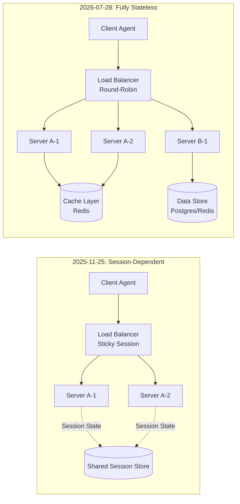

## 1. 서문: 프로토콜 레이어에서 Session이 사라진다는 것의 의미

지난 5주 동안 이 블로그는 AI Agent 생태계의 인프라 레이어를 탐구해왔다:

- **#055 Context Engineering**: MCP session에 기반한 context window 관리와 state 유지 전략
- **#056 Context Observability**: 어떤 context가 왜 evict되었는지 추적하는 observability layer
- **#059 Cross-Trust Handoff**: 서로 다른 trust domain 간 agent session의 전달 문제와 zkML 증명

이 세 글의 공통 전제는 **"MCP 프로토콜 레이어에 session이 존재한다"**는 것이었다. Client는 initialize 핸드셰이크로 server와 session을 맺고, 모든 후속 요청에 Mcp-Session-Id를 실어 보내며, server는 이 session ID로 client의 state를 추적했다.

**2026년 7월 28일, 그 전제가 사라진다.**

MCP 2026-07-28 Release Candidate는 initialize/initialized 핸드셰이크를 제거하고, Mcp-Session-Id 헤더를 폐기하며, persistent SSE 연결을 self-contained HTTP request로 대체한다. **프로토콜 레이어가 완전히 stateless가 되는 것이다.**

이것은 단순한 Transport 업그레이드가 아니다. MCP의 설계 철학이 **"연결(connection) 기반"에서 "메시지(message) 기반"으로 전환**되었음을 의미한다.

이 글에서는 2026-07-28 RC의 변경사항을 코드 레벨에서 해부하고, 이 변경이 Agent 배포 아키텍처와 Cross-Trust 시나리오에 주는 함의를 분석한다.

---

## 2. 무슨 일이 일어났는가: 변경사항의 전모

2026-07-28 RC는 6개의 SEP(Specification Enhancement Proposal)가 협력하여 하나의 Stateless Protocol을 완성한다.

### 2.1 제거된 것

| 구성요소 | SEP | 변경 |
|---------|-----|------|
| initialize/initialized 핸드셰이크 | SEP-2575 | 제거. protocol version, capabilities는 _meta에 실어 매 요청마다 전송 |
| Mcp-Session-Id 헤더 | SEP-2567 | 제거. session state는 data model layer로 이동 |
| Persistent SSE 연결 | SEP-2260 | 제거. server-initiated request는 client request 처리 중에만 허용 |
| 단일 transport 강제 | — | Streamable HTTP가 baseline, transport 선택은 application 자유 |

### 2.2 추가된 것

| 구성요소 | 설명 |
|---------|------|
| MCP-Protocol-Version 헤더 | 매 요청마다 protocol version 명시 |
| Mcp-Method 헤더 | tools/call, resources/read 등 method를 header로 노출 → LB/Gateway가 body 검사 없이 routing 가능 |
| Mcp-Name 헤더 | tool/resource name을 header로 노출 |
| _meta field | clientInfo, capabilities, trace context를 매 request body에 포함 |
| server/discover method | 기존 initialize가 하던 server capabilities 조회 전용 method |
| InputRequiredResult | SSE 없이 elicitation을 구현하는 새로운 response type |
| ttlMs + cacheScope | list/resource read 응답의 캐싱 정책 |

### 2.3 실질적 효과

**Before (2025-11-25)**: MCP server를 horizontal scale-out하려면 sticky session, shared session store, deep packet inspection이 필요했다. SSE 연결이 끊어지면 session이 소멸하고, client는 처음부터 다시 initialize해야 했다.

**After (2026-07-28)**: MCP server는 plain round-robin load balancer 뒤에서 동작한다. 어떤 instance든 어떤 request든 처리할 수 있다. Mcp-Method header로 traffic routing이 가능하고, tools/list 응답은 ttlMs만큼 client-side caching된다.

---

## 3. Before and After: 코드 레벨 비교

### 3.1 Tool Call: 2025-11-25 Spec

```typescript
// === Phase 1: Initialize (Session Establishment) ===
// Client → Server
POST /mcp HTTP/1.1
Content-Type: application/json

{
  "jsonrpc": "2.0",
  "id": 1,
  "method": "initialize",
  "params": {
    "protocolVersion": "2025-11-25",
    "capabilities": { "roots": { "listChanged": true } },
    "clientInfo": { "name": "my-agent", "version": "1.0.0" }
  }
}

// Server → Client (Mcp-Session-Id 발급)
HTTP/1.1 200 OK
Mcp-Session-Id: 1868a90c-3a3f-4f5b-9c7d-1e2f3a4b5c6d
Content-Type: application/json

{
  "jsonrpc": "2.0",
  "id": 1,
  "result": {
    "protocolVersion": "2025-11-25",
    "capabilities": {
      "tools": { "listChanged": true }
    },
    "serverInfo": { "name": "search-server", "version": "2.0.0" }
  }
}

// === Phase 2: Tool Call (Session-ID 의존) ===
// Client → Server (반드시 같은 instance로 routing되어야 함)
POST /mcp HTTP/1.1
Mcp-Session-Id: 1868a90c-3a3f-4f5b-9c7d-1e2f3a4b5c6d
Content-Type: application/json

{
  "jsonrpc": "2.0",
  "id": 2,
  "method": "tools/call",
  "params": {
    "name": "search",
    "arguments": { "q": "MCP stateless design pattern" }
  }
}
```

### 3.2 Tool Call: 2026-07-28 Spec

```typescript
// === 단일 self-contained request ===
// 어떤 server instance든 처리 가능
POST /mcp HTTP/1.1
MCP-Protocol-Version: 2026-07-28
Mcp-Method: tools/call
Mcp-Name: search
Content-Type: application/json

{
  "jsonrpc": "2.0",
  "id": 1,
  "method": "tools/call",
  "params": {
    "name": "search",
    "arguments": { "q": "MCP stateless design pattern" },
    "_meta": {
      "io.modelcontextprotocol/clientInfo": {
        "name": "my-agent",
        "version": "1.0.0"
      },
      "io.modelcontextprotocol/capabilities": {
        "roots": { "listChanged": true }
      },
      "traceparent": "00-0af7651916cd43dd8448eb211c80319c-b7ad6b7169203331-01"
    }
  }
}
```

핵심 차이:
1. **핸드셰이크 불필요**: protocol version, client info, capabilities가 _meta에 실려 매 요청마다 전송
2. **Session-ID 불필요**: server는 요청을 받을 때마다 독립적으로 처리
3. **LB-friendly**: Mcp-Method, Mcp-Name 헤더로 body 검사 없이 routing 가능
4. **Trace context 내장**: W3C Trace Context가 _meta에 포함되어 end-to-end tracing 가능

### 3.3 Server Capabilities 조회: initialize → server/discover

기존 initialize가 client와 server의 capabilities를 동시에 교환하던 것에서, **server/discover**가 server capabilities만 조회하는 전용 method로 분리되었다.

```typescript
// 2026-07-28: Server Capabilities 조회
POST /mcp HTTP/1.1
MCP-Protocol-Version: 2026-07-28
Mcp-Method: server/discover
Content-Type: application/json

{
  "jsonrpc": "2.0",
  "id": 1,
  "method": "server/discover",
  "params": {
    "_meta": {
      "io.modelcontextprotocol/clientInfo": {
        "name": "my-agent", "version": "1.0.0"
      }
    }
  }
}

// Response
HTTP/1.1 200 OK
Content-Type: application/json

{
  "jsonrpc": "2.0",
  "id": 1,
  "result": {
    "protocolVersion": "2026-07-28",
    "capabilities": {
      "tools": {
        "listChanged": true,
        "ttlMs": 60000
      },
      "resources": {
        "subscribe": true,
        "ttlMs": 300000
      },
      "tasks": {
        "supported": true,
        "maxConcurrent": 10
      }
    },
    "serverInfo": {
      "name": "search-server",
      "version": "3.0.0"
    }
  }
}
```

clientInfo가 _meta에 포함되므로, server는 누가 요청했는지 알 수 있다. **연결 기반 인증이 아니라 요청 기반 인증**으로 전환된 것이다.

---

## 4. Explicit Handle Pattern: Session의 데이터 모델 레이어 이동

가장 오해하기 쉬운 지점: **"MCP가 stateless가 되었다 = application도 stateless여야 한다"는 것은 아니다.**

프로토콜 레이어가 session을 관리하지 않을 뿐, application은 필요하다면 자신의 데이터 모델 레이어에서 state를 관리할 수 있다. 그리고 MCP 팀이 권장하는 방식이 바로 **Explicit Handle Pattern**이다.

### 4.1 Explicit Handle Pattern의 원리

Server는 tool call의 결과로 **opaque handle**(basket_id, workflow_run_id, session_token 등)을 발급하고, model(client)은 이 handle을 이후 tool call의 argument로 다시 전달한다.

```typescript
// === TypeScript: ExplicitHandleManager ===
interface SessionState {
  basketId: string;
  items: BasketItem[];
  createdAt: Date;
  expiresAt: Date;
}

class ExplicitHandleManager {
  private store: Map<string, SessionState> = new Map();

  /**
   * tool call 결과로 stateful handle 발급
   * - handle 자체는 opaque token
   * - server만이 handle → state 매핑을 알고 있음
   */
  createBasket(toolName: string, args: Record<string, unknown>): {
    resultType: "text";
    text: string;
    _handle: string;
  } {
    const basket: SessionState = {
      basketId: crypto.randomUUID(),
      items: [],
      createdAt: new Date(),
      expiresAt: new Date(Date.now() + 30 * 60 * 1000), // 30분 TTL
    };
    this.store.set(basket.basketId, basket);

    return {
      resultType: "text",
      text: `Basket created: ${basket.basketId}`,
      // Handle을 결과의 일부로 반환
      _handle: basket.basketId,
    };
  }

  /**
   * model이 전달한 handle로 stateful 작업 수행
   * - model은 handle의 의미를 알 필요 없음
   * - server가 handle → state 매핑을 수행
   */
  addToBasket(basketId: string, item: string): {
    resultType: "text";
    text: string;
  } {
    const basket = this.store.get(basketId);

    if (!basket || basket.expiresAt < new Date()) {
      return {
        resultType: "text",
        text: "Error: Basket not found or expired. Please create a new basket.",
      };
    }

    basket.items.push({ id: crypto.randomUUID(), name: item, addedAt: new Date() });
    return {
      resultType: "text",
      text: `Added "${item}" to basket ${basketId}. Total items: ${basket.items.length}`,
    };
  }
}
```

### 4.2 Protocol-Level Session vs Explicit Handle: 왜 Explicit Handle이 더 강력한가

MCP 팀의 공식 문서는 이렇게 말한다:

> "The model can compose handles across tools, reason about them, and hand them off between steps in ways that externally managed session state, hidden in transport metadata, never really allowed."

즉, protocol-level session은 transport metadata로 감춰져 있어 **model이 session의 존재를 인지하지 못했다**. 반면 explicit handle은:

1. **Model이 handle을 직접 보고 추론할 수 있다**: "이 basket_id를 가진 장바구니에 물건을 3개 넣었으니, 이제 결제 tool을 호출하자"
2. **Handle을 cross-tool로 전달할 수 있다**: search tool이 반환한 result_id를, summarize tool에 전달
3. **Handle을 cross-session으로 전달할 수 있다**: 한 세션에서 생성된 handle을 다른 세션의 model에게 전달
4. **Handle을 로깅하고 추적할 수 있다**: observability system이 handle을 key로 session state 변화를 추적

```typescript
// === Model의 Handle Reasoning 예시 ===
// Model이 handle을 tool call 간에 추론하는 패턴
const THREAD: Message[] = [
  { role: "user", content: "커피 원두 2kg를 장바구니에 담아줘" },
  // Model → Server: createBasket()
  { role: "assistant", content: "장바구니를 생성했습니다.", tool_calls: [
    {
      id: "call_1",
      type: "function",
      function: {
        name: "create_basket",
        arguments: "{}"
      }
    }
  ]},
  // Server Response: handle 반환
  { role: "tool", content: '{"resultType":"text","text":"Basket created: basket_abc123","_handle":"basket_abc123"}', tool_call_id: "call_1" },
  // Model이 handle을 보고 addToBasket 호출 결정
  { role: "assistant", content: "장바구니(basket_abc123)에 커피 원두 2kg를 추가하겠습니다.", tool_calls: [
    {
      id: "call_2",
      type: "function",
      function: {
        name: "add_to_basket",
        arguments: '{"basketId":"basket_abc123","item":"커피 원두 2kg"}'
      }
    }
  ]}
];
```

### 4.3 Stateless Elicitation: InputRequiredResult

SSE persistent connection이 사라지면서, **server가 client에게 추가 입력을 요청하는 방법**도 바뀌었다. 2025-11-25에서는 SSE stream을 열어두고 server가 임의로 event를 push할 수 있었다. 2026-07-28에서는 **Multi Round-Trip Request** 패턴으로 대체된다.

```typescript
// === TypeScript: ElicitationClient 예시 ===

interface InputRequiredResult {
  resultType: "inputRequired";
  inputRequests: Record<string, InputRequest>;
  requestState: string; // opaque token, server가 resume에 필요한 모든 정보를 인코딩
}

interface InputRequest {
  type: "elicitation";
  message: string;
  schema: JSONSchema;
}

class ElicitationClient {
  /**
   * Server가 inputRequired를 반환하면,
   * client가 입력을 모아서 다시 같은 요청을 re-issue
   */
  async handleElicitation(
    originalRequest: JSONRPCRequest,
    inputRequired: InputRequiredResult
  ): Promise<JSONRPCResponse> {
    // Step 1: inputRequests를 사용자/agent에게 표시
    const inputResponses: Record<string, unknown> = {};

    for (const [key, request] of Object.entries(inputRequired.inputRequests)) {
      if (request.type === "elicitation") {
        // User 또는 upstream agent에게 입력 요청
        inputResponses[key] = await this.promptUser(request.message, request.schema);
      }
    }

    // Step 2: 같은 method에 inputResponses + requestState를 실어 재전송
    const retryRequest: JSONRPCRequest = {
      ...originalRequest,
      params: {
        ...originalRequest.params,
        inputResponses,
        requestState: inputRequired.requestState,
      },
    };

    // Step 3: 어떤 server instance든 처리 가능
    // (requestState에 모든 resume 정보가 들어있음)
    return await this.transport.send(retryRequest);
  }

  private async promptUser(message: string, schema: JSONSchema): Promise<unknown> {
    // 실제 구현: 사용자에게 dialog 표시 또는 upstream agent 호출
    console.log(`[Elicitation Required] ${message}`);
    return schema.type === "boolean" ? true : prompt(message);
  }
}
```

**requestState**가 핵심이다. 이 opaque token은 server가 요청을 resume하는 데 필요한 모든 state를 인코딩한다 (base64 encoded JSON, signed JWT, 또는 encrypted blob). Client는 token의 내용을 알 필요 없이, 다음 요청에 그대로 echo하기만 하면 된다.

---

## 5. 인프라 변화: 배포와 운영

Stateless protocol의 가장 실질적인 이점은 **배포 인프라의 단순화**다.

### 5.1 Load Balancing: Sticky Session → Round-Robin

```yaml
# === Docker Compose: Stateless MCP Server ===
version: "3.8"
services:
  mcp-server:
    image: my-mcp-server:3.0.0
    deploy:
      replicas: 5
      # sticky session 불필요!
    environment:
      - MCP_PROTOCOL_VERSION=2026-07-28
      - DATA_STORE_URL=redis://redis:6379

  nginx:
    image: nginx:alpine
    volumes:
      - ./nginx.conf:/etc/nginx/conf.d/default.conf
    ports:
      - "8080:80"

  redis:
    image: redis:7-alpine
    # explicit handle의 state store로 사용

# nginx.conf — plain round-robin
# upstream mcp_servers {
#   server mcp-server:3000;
#   server mcp-server:3001;
#   server mcp-server:3002;
#   # no ip_hash, no sticky!
# }
```

### 5.2 Caching: ttlMs + cacheScope

```typescript
// === Server: tools/list 응답에 cache policy 포함 ===
server.setRequestHandler(ListToolsRequestSchema, async () => ({
  tools: [
    {
      name: "search",
      description: "Search the web",
      inputSchema: { type: "object", properties: { q: { type: "string" } } },
    }
  ],
  // client는 60초 동안 이 응답을 cache 가능
  // cacheScope: "global" → 모든 user가 동일한 응답 공유 가능
  _meta: {
    ttlMs: 60000,
    cacheScope: "global",
  }
}));

// === Client: Cache-Aware Client ===
class CacheAwareMCPClient {
  private toolListCache: { tools: Tool[]; expiresAt: number } | null = null;

  async listTools(): Promise<Tool[]> {
    const now = Date.now();

    // ttlMs가 cache hit을 결정
    if (this.toolListCache && this.toolListCache.expiresAt > now) {
      return this.toolListCache.tools;
    }

    const response = await this.sendRequest("tools/list", {});
    const ttlMs = response._meta?.ttlMs ?? 0;

    if (ttlMs > 0) {
      this.toolListCache = {
        tools: response.tools,
        expiresAt: now + ttlMs,
      };
    }

    return response.tools;
  }
}
```

### 5.3 Distributed Tracing: W3C Trace Context

2026-07-28 RC에서 W3C Trace Context의 key name이 spec에 공식 문서화되었다. `traceparent`, `tracestate`, `baggage`가 `_meta` 아래 고정 key로 지정된다.

```typescript
// === TypeScript: Trace Context Propagation Middleware ===
class TracePropagationMiddleware {
  private tracer: opentelemetry.Tracer;

  /**
   * MCP request의 _meta에 trace context를 주입
   * Host application → Client SDK → MCP Server → Downstream API
   * 전체가 하나의 span tree로 연결됨
   */
  injectTraceContext(params: Record<string, unknown>): Record<string, unknown> {
    const span = opentelemetry.trace.getActiveSpan();
    if (!span) return params;

    const traceContext = span.spanContext();

    return {
      ...params,
      _meta: {
        ...(params._meta as Record<string, unknown>),
        // W3C traceparent: version-traceId-spanId-traceFlags
        traceparent: `00-${traceContext.traceId}-${traceContext.spanId}-${traceContext.traceFlags}`,
        // tracestate: vendor-specific trace data
        tracestate: `mcp=tool_call,otel=prod`,
        // baggage: propagation key-value pairs
        baggage: `user_id=sjlee,request_id=req_abc123`,
      },
    };
  }
}
```

이것의 실질적 의미: **MCP 호출 하나가 Host Application → Agent → MCP Client SDK → MCP Server → Downstream Database로 이어지는 전체 호출 체인이 하나의 OpenTelemetry trace로 연결된다.** 문제가 발생했을 때, "어느 tool call에서 latency spike가 발생했는지"를 단일 trace로 추적할 수 있다.

---

## 6. Breaking Changes Migration Guide

2026-07-28은 **breaking changes를 포함하는 최대 규모의 개정**이다. Early adopters는 7월 28일까지 아래 3가지 migration을 완료해야 한다.

### 6.1 Migration 1: initialize → server/discover

```typescript
// === Before (2025-11-25) ===
const client = new MCPClient({
  transport: new StreamableHTTPTransport("https://mcp.example.com/mcp"),
});

await client.initialize(); // Handshake + Session Establishment

// === After (2026-07-28) ===
const client = new MCPClient({
  transport: new StreamableHTTPTransport("https://mcp.example.com/mcp"),
  protocolVersion: "2026-07-28",
});

// initialize 대신 server/discover 호출 (필요시)
const serverCaps = await client.discover();
// Server capabilities 조회 후 결정:
// - tools/list: 캐싱 가능 (ttlMs 확인)
// - tool call: 바로 가능
```

### 6.2 Migration 2: Mcp-Session-Id → Explicit Handle

```typescript
// === Before (2025-11-25): Session ID 기반 ===
class SessionBasedServer {
  private sessions: Map<string, SessionState> = new Map();

  async handleInitialize(sessionId: string): Promise<void> {
    this.sessions.set(sessionId, { context: [], createdAt: new Date() });
  }

  async handleToolCall(sessionId: string, tool: string, args: unknown): Promise<Result> {
    const session = this.sessions.get(sessionId);
    if (!session) throw new Error("Session not found");
    // session context 사용...
  }
}

// === After (2026-07-28): Explicit Handle 기반 ===
class ExplicitHandleServer {
  private stores: Map<string, DataStore> = new Map();

  async handleToolCall(tool: string, args: Record<string, unknown>): Promise<Result> {
    // Handle은 tool argument로 직접 전달
    const handle = args._handle as string | undefined;

    // Handle이 없으면 stateless operation
    if (!handle) {
      return this.executeStateless(tool, args);
    }

    // Handle이 있으면 stateful operation
    const store = await this.getStore(handle);
    return this.executeStateful(tool, args, store);
  }
}
```

### 6.3 Migration 3: SSE → Streamable HTTP

```typescript
// === Before (2025-11-25): SSE Transport ===
// client는 SSE stream을 열어두고 server push를 기다림
const sseTransport = new SSEClientTransport(
  new URL("https://mcp.example.com/mcp/sse")
);
await sseTransport.start();
sseTransport.onmessage = (msg) => {
  if (msg.type === "resource_list_changed") {
    // SSE stream을 통한 push notification
  }
};

// === After (2026-07-28): Streamable HTTP ===
// 모든 통신은 요청-응답 기반
// 변경 알림은 listChanged subscription으로 대체
const transport = new StreamableHTTPTransport(
  new URL("https://mcp.example.com/mcp"),
  { protocolVersion: "2026-07-28" }
);

// 변경 사항은 polling + ttlMs 기반 캐시 무효화로 감지
// 또는 subscribe method로 변경 알림 구독 (SSE 불필요)
await transport.subscribe("resource_list_changed");
```

---

## 7. 확장: Tasks Extension과 OAuth 2.1

2026-07-28 RC는 stateless core 외에도 몇 가지 중요한 확장을 포함한다.

### 7.1 Tasks Extension: 장기 실행 작업의 공식 lifecycle

Tasks extension이 실험적(experimental)에서 **정식 확장(formal extension)**으로 승격되었다. Clean lifecycle을 제공한다:

```typescript
// === Tasks Lifecycle ===
// 1. tasks/send: 작업 제출 (즉시 taskId 반환)
POST /mcp HTTP/1.1
Mcp-Method: tasks/send
Content-Type: application/json

{
  "method": "tasks/send",
  "params": {
    "uri": "task://long-running-analysis",
    "input": {
      "data": "...",
      "parameters": { "depth": "full" }
    }
  }
}

// 2. tasks/get: 진행 상태 확인
POST /mcp HTTP/1.1
Mcp-Method: tasks/get

{
  "method": "tasks/get",
  "params": {
    "id": "task_analysis_001"
  }
}

// 3. tasks/update: 작업 업데이트
{
  "method": "tasks/update",
  "params": {
    "id": "task_analysis_001",
    "input": { "priority": "high" }
  }
}

// 4. tasks/cancel: 작업 취소
{
  "method": "tasks/cancel",
  "params": {
    "id": "task_analysis_001",
    "reason": "user requested cancellation"
  }
}
```

Tasks Extension은 **stateless protocol 위에서 stateful workflow를 실행할 수 있는 표준화된 방법**을 제공한다. Session이 protocol layer에서 data model layer로 이동하면서, long-running 작업의 lifecycle도 명시적인 API 형태로 재정의된 것이다.

### 7.2 OAuth 2.1 + PKCE 의무화

모든 remote MCP server는 OAuth 2.1 with PKCE를 **의무적으로** 구현해야 한다. RFC 8707 Resource Indicators도 필수로, token replay attack을 방지한다.

```typescript
// === OAuth 2.1 + PKCE Authorization Flow ===
// 1. Client: code_verifier와 code_challenge 생성
const codeVerifier = crypto.randomUUID();
const codeChallenge = await crypto.subtle.digest("SHA-256",
  new TextEncoder().encode(codeVerifier)
).then(buf => btoa(String.fromCharCode(...new Uint8Array(buf))));

// 2. Authorization Request with Resource Indicator
const authUrl = `https://auth.mcp-server.com/authorize?` +
  `response_type=code&` +
  `client_id=${clientId}&` +
  `code_challenge=${codeChallenge}&` +
  `code_challenge_method=S256&` +
  `resource=https://mcp.example.com/mcp`;  // RFC 8707: token-target binding

// 3. Token Request with code_verifier
const tokenResponse = await fetch("https://auth.mcp-server.com/token", {
  method: "POST",
  headers: { "Content-Type": "application/x-www-form-urlencoded" },
  body: new URLSearchParams({
    grant_type: "authorization_code",
    code: authorizationCode,
    code_verifier: codeVerifier,
    client_id: clientId,
    resource: "https://mcp.example.com/mcp",
  }),
});
```

---

## 8. 이 변경이 Agent 생태계에 주는 의미: #059 Cross-Trust Handoff와의 연결

이 변경이 Agent 생태계, 특히 **Cross-Trust Handoff** 시나리오에 주는 함의를 분석하는 것이 이 글의 진짜 목적이다.

### 8.1 Protocol Session이 없어지면 Cross-Trust는 더 쉬워질까?

#059에서 다룬 근본 문제는 다음과 같다: Agent A(은행)가 Agent B(보험사)에게 handoff할 때, Agent A의 session context를 어떻게 Agent B에게 안전하게 전달할 것인가?

2025-11-25 spec에서는 이것이 구조적으로 어려웠다. Session ID는 Server A가 발급했고, Server B는 이 Session ID를 알지 못했다. Session state는 Server A의 메모리에만 존재했다. Cross-trust handoff를 위해서는 **Session Migration**이라는 별도의 메커니즘이 필요했다.

**2026-07-28 spec에서는 이 문제의 성격이 바뀐다.**

1. **Protocol layer의 session이 사라졌다**: Server A가 Server B에게 "우리의 Agent A session을 전달해달라"고 요청할 필요가 없다. Protocol layer에 session이 없기 때문이다.

2. **Data model layer의 explicit handle은 전달 가능하다**: Server A가 발급한 handle(basket_id, workflow_run_id)은 단순한 string일 뿐이다. Server A가 이 handle을 검증 가능한 방식(signed JWT, zero-knowledge proof)으로 발급했다면, Server B는 이 handle을 그대로 사용할 수 있다.

3. **문제는 protocol layer가 아니라 data model layer로 이동했다**: "어떻게 handle이 위조되지 않았는지 증명할 것인가?" "어떻게 handle에 담긴 data가 변조되지 않았는지 보장할 것인가?" — protocol layer의 문제가 사라진 대신, data model layer에서 동일한 문제를 해결해야 한다.

### 8.2 Stateless Protocol + Explicit Handle + ZK Proof

가장 흥미로운 조합은 **Stateless Protocol + Explicit Handle + Zero-Knowledge Proof**다.

```typescript
// === Cross-Trust Verification Handle ===
// Server A가 발급한 handle을 Server B가 검증
interface VerifiableHandle {
  // opaque handle (Server A의 내부 session key)
  handle: string;

  // Zero-knowledge proof of handle validity
  // Server B는 이 proof로 handle이 위조되지 않았음을 검증
  // Server B는 handle의 내부 데이터를 알 필요 없음
  proof: {
    type: "zkp-snark" | "signed-jwt" | "merkle-proof";
    value: string;
    // Server A의 public key (verification key)
    verifier: string;
    // handle의 검증 가능한 속성들 (선택적 공개)
    publicAttributes?: Record<string, unknown>;
  };

  // Handle의 만료 시간
  expiresAt: string;
}
```

이 구조에서 protocol layer의 statelessness는 **cross-trust handoff의 복잡성을 protocol transport에서 data integrity 증명으로 이동**시킨다. protocol layer는 "누구나 요청을 보낼 수 있다"는 단순함을 유지하고, 보안과 신뢰는 data model layer의 암호학적 증명이 담당한다.

### 8.3 배포 아키텍처의 변화



좌측(2025-11-25)에서는 모든 server instance가 동일한 shared session store에 접근해야 했고, sticky session이 필요했다. 우측(2026-07-28)에서는 server instance가 완전히 독립적이며, cache layer는 ttlMs 기반의 optional 성능 최적화 도구일 뿐이다.

---

## 9. 자가 검토 (Self-Critique)

이 글의 한계와 차별화 지점을 명시한다:

1. **#055 Context Engineering과의 차별화**: #055는 MCP session 내에서 context window를 관리하는 application-level 전략을 다뤘다. 본 글은 session 자체가 protocol layer에서 제거된 새로운 spec 자체를 분석한다. #055는 "session이 있다는 전제 하에 어떻게 잘 쓸까"였다면, 본 글은 "session이 없어졌는데 어떻게 대처할까"다.

2. **#056 Context Observability와의 차별화**: #056은 session eviction을 추적하는 observability layer 구축이 핵심이었다. 본 글은 protocol layer의 stateless화가 observability에 W3C Trace Context 기반의 표준적인 접근을 제공하는 점을 다룬다. 단, 본 글은 observability보다는 protocol architecture에 초점을 맞추며, tracing은 그 일부로만 다룬다.

3. **#059 Cross-Trust Handoff와의 차별화**: #059는 다른 trust domain 간 session 전달을 zero-knowledge proof로 해결하는 방법이었다. 본 글은 protocol session 자체의 제거가 cross-trust scenario에 어떤 영향을 주는지 분석한다. 중요한 것은: **protocol session 제거는 cross-trust 문제를 해결하지 않고, 문제의 성격을 protocol layer에서 data model layer로 이동시킨다**는 점이다.

4. **이 글의 한계**:
   - 2026-07-28 RC는 아직 최종 spec이 아니다(7월 28일 확정). 일부 세부사항이 변경될 수 있다.
   - Explicit Handle Pattern은 MCP 팀이 권장하는 패턴이지만, 이것이 유일한 방법은 아니다. OAuth 2.1 session token, signed JWT claim 등 다양한 접근이 가능하다.
   - Tasks Extension의 구체적인 구현과 성능은 SDK가 안정화된 후 평가해야 한다.
   - OAuth 2.1 + PKCE 의무화는 remote server에 한정되며, local(stdio) transport는 해당하지 않는다.

5. **다음 글의 방향성**: Session이 data model layer로 이동하면서, "에이전트가 cross-trust 시나리오에서 data model level의 session 상태를 어떻게 안전하게 주고받을 것인가"가 다음 과제가 된다. 이는 **Data Model Level의 Session State Synchronization Protocol**이라는 새로운 주제로 이어질 수 있다. 즉, protocol layer의 단순화는 data model layer의 복잡성을 증가시켰고, 이 복잡성을 해결하기 위한 표준화된 접근이 필요하다.

---

## 10. 결론

MCP 2026-07-28의 stateless 전환은 단순한 Transport 업그레이드가 아니라 **"연결 중심(connection-oriented)"에서 "메시지 중심(message-oriented)"으로의 설계 철학 전환**이다.

변경의 핵심 메시지는 다음과 같다:

1. **프로토콜은 단순해야 한다**: 연결 관리, session state, transport metadata를 protocol layer가 관리하는 것은 복잡하다. Protocol은 message routing과 format만 정의하고, 나머지는 상위 layer에 위임하자.

2. **Model에게 노출하라**: Session ID를 transport metadata로 숨기는 대신, explicit handle을 tool argument로 노출하면 model이 state를 추론하고 조작할 수 있다.

3. **인프라와 호환되어야 한다**: sticky session, shared session store, deep packet inspection은 표준 HTTP 인프라와 호환되지 않는다. Round-robin LB, standard caching, header-based routing — 이미 검증된 인프라 위에서 동작하게 하자.

4. **보안은 protocol이 아니라 data layer에서**: OAuth 2.1, PKCE, signed JWT, ZK proof — protocol이 아니라 data layer의 암호학적 메커니즘이 보안을 담당하게 하자.

2026년 7월 28일, MCP는 실험적인 프로토콜에서 **프로덕션 인프라**로 도약한다. 그리고 이 변화는 Agent 생태계 전체의 아키텍처 설계에 새로운 기준을 제시할 것이다.
